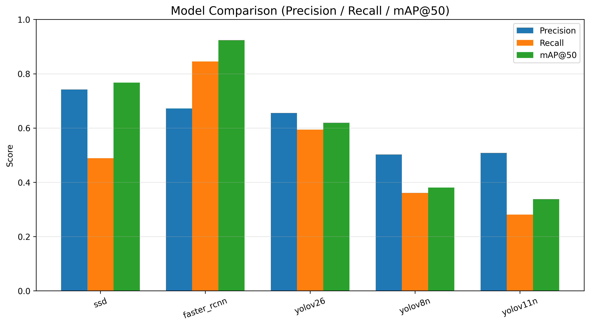

## Results

# FoodVisionProject — Object Detection Benchmark

---
**Dataset:** https://universe.roboflow.com/semproject-5w89z/food-detection-tyd55

**Scientific report:**


---


---
## Описание проекта

Данный проект посвящён сравнительному анализу современных моделей детекции объектов на задаче распознавания продуктов питания.

Цель работы — исследовать качество различных архитектур (CNN-based и Transformer-based) и провести системное сравнение их эффективности на едином датасете.

---

## Используемые модели

В рамках проекта были реализованы и протестированы следующие модели:

* SSD
* Faster R-CNN
* YOLOv8n
* YOLOv11n
* YOLO26
* DETR (Transformer-based)

---

## Датасет

Использован датасет с **38 классами продуктов питания**, подготовленный в формате YOLO.

Источник: Roboflow / кастомная разметка

---

## Метрики оценки

Для оценки качества моделей использовались стандартные метрики object detection:

* Precision
* Recall
* F1-score
* mAP@0.5
* mAP@0.5:0.95 (для части моделей)

---

##  Результаты экспериментов

| Model        | Precision | Recall | F1-score | mAP@0.5 | mAP@0.5:0.95 |
| ------------ | --------- | ------ | -------- | ------- | ------------ |
| SSD          | 0.7417    | 0.4885 | 0.5890   | 0.7675  | -            |
| Faster R-CNN | 0.6722    | 0.8450 | 0.7488   | 0.9239  | 0.7354       |
| YOLOv26      | 0.6551    | 0.5944 | 0.6233   | 0.6194  | 0.4727       |
| YOLOv8n      | 0.5025    | 0.3613 | 0.4203   | 0.3807  | 0.2685       |
| YOLOv11n     | 0.5086    | 0.2812 | 0.3622   | 0.3380  | 0.2431       |
| DETR         | —         | —      | —        | —       | —            |

*DETR: результаты не включены из-за технических проблем при инференсе модели (несоответствие весов / конфигурации).*

---

## Visual Results


## Выводы

* Наилучшее качество по mAP@0.5 показала модель **Faster R-CNN**
* YOLO модели обеспечивают хороший баланс скорости и качества
* Transformer-based DETR требует дополнительной настройки для стабильной работы
* Классические CNN модели остаются конкурентоспособными на малых датасетах

---

## Структура проекта

```text
FoodVisionProject/
│
├── data/
│   ├── raw/
│   └── processed/
│
├── src/
│   ├── dataset/
│   ├── models/
│   ├── training/
│   ├── evaluation/
│   └── utils/
│
├── configs/
├── results/
│   ├── logs/
│   ├── plots/
│   └── metrics/
│
├── notebooks/
├── main.py
└── README.md
```

---

## Запуск проекта

Пример запуска одной модели:

```bash
python main.py --model faster_rcnn
```

Другие модели:

```bash
python main.py --model ssd
python main.py --model yolov8n
python main.py --model yolov11n
python main.py --model yolov26
python main.py --model detr
```

---

## Результаты сохраняются в:

* Метрики: `results/metrics/`
* Логи: `results/logs/`
* Графики: `results/plots/`

---

## Воспроизводимость

Для обеспечения воспроизводимости экспериментов:

* фиксирован seed = 42
* единый датасет для всех моделей
* единый pipeline оценки
* стандартизированные метрики

---

## Особенности проекта

* 6 моделей детекции объектов
* сравнение CNN и Transformer архитектур
* единый evaluation pipeline
* визуализация результатов
* структурированный ML pipeline

---

## 👩‍💻 Автор: Нестерова В.Р.

Проект выполнен в рамках учебного курса по Computer Vision.
